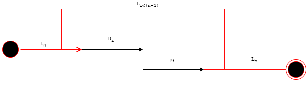
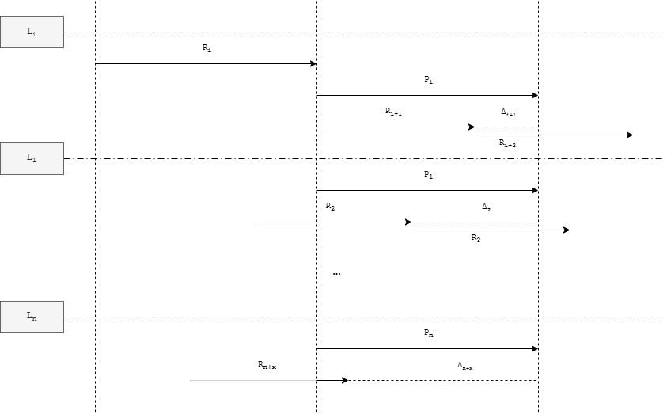

# A Look at Prefetching

## Introduction

Prefetching as a concept is not new, but I'd like to attempt deriving it without reading existing papers or implementations, as if it were the early 90s and I were an intern tasked with finding a way to speed up a process.

This is more of an exercise in writing a white paper and implementing the idea myself.

In modern terms, this is the infamous TODO app but this explores something slightly different. I'm not claiming to solve a new problem; I'm simply having fun investigating an idea.

> **Scope:** Server-side paging / pagination processing.

## Context

When processing paged data over a network, execution is typically sequential.

 \
**Figure 1.1: Sequential paging model**

### Where

| Symbol | Definition |
|---------|------------|
| $L$ | Main processing loop |
| $i$ | Current iteration |
| $n$ | Total number of pages |
| $R_i$ | Retrieving page $i$ |
| $P_i$ | Processing page $i$ |
| $L_0$ | Initial loop entry |
| $L_n$ | Final loop iteration |

The loop executes while:

$$
0 \le i < n
$$

## Sequential Time Analysis

For simplicity, assume retrieval and processing each take a constant amount of time, or more realistically, their average execution time.

$$
T_S = n(R_{avg} + P_{avg})
$$

Where:

- $R_{avg}$ = average retrieval time
- $P_{avg}$ = average processing time

The total runtime is therefore the cost of retrieving and processing every page sequentially.

## Prefetching

The idea is simple: while processing page $i$, another thread retrieves page $i+1$ (or more). Instead of the CPU waiting on network I/O, that waiting time is hidden behind processing.

\
**Figure 1.2: Prefetch paging model**

### Where

- $R_i$, $P_i$, and $L_i$ represent the same things as Figure 1.1.
- $\Delta_i$ is the time difference between $R_i$ and $P_{i-1}$.
- For $i = 0$, $\Delta_0$ is undefined since $P_{-1}$ does not exist. but we treat it as 0 because it results in the same sequential behaviour we see/expect from $R_1$ and $P_1$
- $X$ is the number of prefetched pages currently waiting in memory.

In theory:

$$
T_P = R_1 + nP_{avg}
$$

Compared to the sequential model:

$$
n(R_{avg}+P_{avg}) \ge R_1 + nP_{avg}
$$

Which gives a theoretical saving of:

$$
nR_{avg} - R_1
$$

The important idea is that retrieval happens once at the beginning, after which processing becomes the dominant operation because the following retrievals are occurring in parallel.

## Looking at $\Delta$

While **$\Delta > 0$**, retrieval is completing faster than processing, meaning pages begin accumulating before processing catches up. At loop $L_i$, there may already be **$X$** pages waiting for $P_i$ to complete.

This immediately raises the trade-off: memory usage.

If $\Delta_{avg} > 0$, prefetched pages continue accumulating in memory.

If $\Delta_{avg} < 0$, the opposite happens. Processing finishes before the next retrieval completes, so $\Delta$ becomes the remaining waiting period before the next processing step can continue. Even then, it is still better than purely sequential execution because part of $R_{i+1}$ was fetched while $P_i$ was running.

In that case:

$$
T_P = nR_{avg} + P_n
$$

The benefit comes from overlapping retrieval with processing rather than removing retrieval altogether.

## Queue Depth

To estimate how many pages may be waiting, we can look at:

$$
S_{avg} = \frac{P_{avg}}{R_{avg}}
$$

Where $S_{avg}$ represents the relative speed of processing compared to retrieval.

> **Note:** The following queue depth model is not a formally derived proof. Its purpose is to approximate queue growth under average timings.

### Case 1: $S_{avg} > 1$

Processing is slower than retrieval, so pages accumulate.

$$
X = \lfloor S_{avg}(i+1) - i \rfloor 
$$

### Case 2: $S_{avg} = 1$

Both operations take the same amount of time.

$$
X = 1
$$

Which makes intuitive sense: when $P_i$ finishes, $R_{i+1}$ also finishes, meaning exactly one page is waiting.

### Case 3: $S_{avg} < 1$

Retrieval is slower than processing.

Example:

- $P_{avg} = 1$
- $R_{avg} = 1.5$
- $S_{avg} = 0.66$

Substituting:

$$
X = \lfloor 0.66(i+1) - i \rfloor
$$

For values of $i > 0$, the result becomes negative, which is not meaningful for queue depth.

So the adjusted model becomes:

$$
X = \max\left(0,\ \lfloor S_{avg}(i+1) - i \rfloor\right)
$$

## Some Notes

This is great, but if $R_{avg}$ is already very small relative to $P_{avg}$, the time saved compared to the total runtime may end up being negligible.

Which brings us to two types of scenarios when $P_{avg}$ and $R_{avg}$ are unbalanced.

You get what's some would call the **"lobster too buttery, steak too tender"** kind of situation on one end, and **"what was the point of all this?"** on the other.

### "Lobster Too Buttery, Steak Too Tender"

$$
P_{avg} \gg R_{avg}
$$

If processing takes significantly longer than retrieval, then by the time $P_i$ is done you will have accumulated a lot of pages waiting to be processed. The queue increases by roughly $(X-1)$ every iteration, so memory usage becomes something you need to consider.

If parallel processing is available, this becomes a beautiful problem to have. If not, the simplest solution is to cap the number of prefetched pages.

Adjusted:

$$
X = \min\left(X_{max},\ \max\left(1,\ \lfloor S_{avg}(i+1)-i\rfloor\right)\right)
$$

Where $X_{max}$ is the maximum number of pages allowed to wait in memory.

### "What's the Point of All This?"

$$
P_{avg} \ll R_{avg}
$$

If retrieval takes much longer than processing, then by the time $P_i$ finishes there is nothing waiting to process. The system still waits for $\Delta_{avg}$, making the whole thing an overcomplicated sequential process with only a tiny improvement.

I say *tiny* because the only time being hidden is $P$, and if $P$ is already small compared to $R$, then the saving becomes almost a rounding error.

## Closing Thoughts

So yeah, that's my take on it.

Nothing here is world-changing. I mainly wanted to explore a familiar problem from first principles, without relying on existing papers or implementations, and use it as an exercise in testing my thinking on a problem most people are already familiar with.

Stay tune for part2 where I'll implement this in c# so that we have imperical data :)